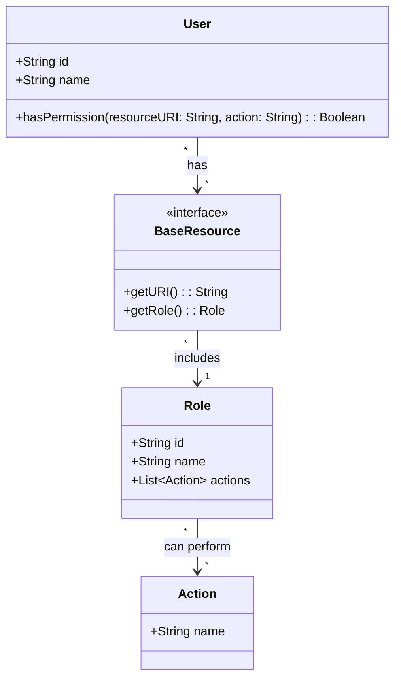

## Proposal: Transition to a Resource-Based Permissions System

### Current System
- **Simplistic Role-Based Checks:** Currently, permissions are checked by verifying the user's role (e.g., `ROLE == 'MANAGER'`).
- **Limitations:**
  - **Rigid and Inflexible:** Adding new roles requires code changes, leading to potential errors and increased maintenance efforts.
  - **Granularity Issues:** Roles are not granular enough to specify permissions at a resource or action level.
  - **Scalability Concerns:** As the number of roles and permissions grows, managing and verifying roles become increasingly complex.

### Proposed System
**User > Role > Resource > Actions**

#### Diagram

### Key Benefits
#### Enhanced Flexibility:
- Granular Permissions: Define specific actions (e.g., create, read, update, delete) for each resource, allowing precise control over what users can do.
- Dynamic Role Assignments: Roles can be updated without changing the underlying code, making it easier to adapt to new requirements.
#### Improved Scalability:
- Decoupled Roles and Actions: Easily add new roles and actions without extensive code modifications.
- Hierarchical Role Management: Support for nested roles or composite permissions, simplifying permission management as the system grows.
#### Increased Security:
- Principle of Least Privilege: Assign the minimum necessary permissions to each role, reducing the risk of unauthorized access.
- Auditable Permissions: Centralized permission checks provide a clear audit trail of who has access to what resources and actions.
#### Maintainability:
- Centralized Permission Logic: By abstracting permissions into roles and actions associated with resources, changes are easier to implement and test.
- Reduced Code Duplication: Eliminate redundant role checks scattered throughout the codebase, reducing potential for errors.
#### Seamless Integration:
- Frontend and Backend Abstraction: Both frontend and backend can rely on a consistent permission checking mechanism (hasPermission method), simplifying development and integration.
